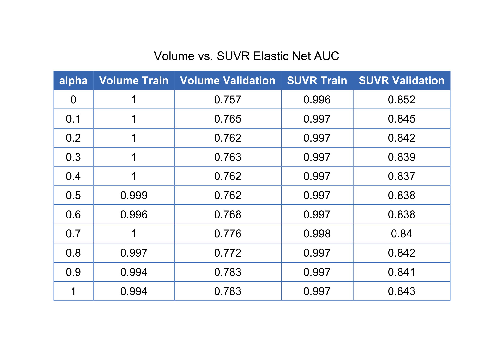

# Filtering and Classifying ADNI Participants

## Contributors:

-   [Brian Collica](https://github.com/bcollica)
-   James Koo
-   Ryan Roggenkemper
-   Ben Searchinger

## TLDR

This repository contains R and Python code for reproducing our analysis of data from the Alzheimer's Disease Neuroimaging Initiative (ADNI). The model is a two-stage process whereby participants are filtered based their estimated risk for being amyloid-beta positive, and then subsequently classified as either high or low risk for Alzheimer's Disease.

## Data Acquisition

All data required are available through [ADNI](https://adni.loni.usc.edu/) and the Image and Data Archive provided by the [Laboratory of Neuro Imaging](https://www.loni.usc.edu/) at the University of Southern California.

## Repository Structure

The repository has five main directories: `ADNI_data`, `processed_data`, `R`, `nitorch`, and `CNN`. The following raw data files must be downloaded from ADNI and put into `ADNI_data`:

-   `ADNIMERGE.csv`: a collection of key metrics and observations for all ADNI participants
-   `UPENNBIOMK_MASTER.csv`: cerebrospinal fluid analysis (University of Pennsylvania).
-   `UCBERKELEYAV45_01_14_21.csv`: AV45 PET analysis (University of California, Berkeley).
-   `UCBERKELEYFDG_05_28_20.csv`: FDG PET analysis (University of California, Berkeley).
-   `UCBERKELEYAV1451_01_14_21.csv`: tau PET analysis (University of California, Berkeley).
-   `ADNI_UCD_WMH_09_01_20.csv`: white matter hyperintensities (University of California, Davis).
-   `ADNI_PICSLASHS_05_05_20.csv`: medial temporal lobe measurements (University of Pennsylvania).

## Code Replication

Once the data files have been placed in the `ADNI_data` directory, run the following R scripts with the working directory set at the top level of the repo.

### Amyloid Positivity Data Processing

The R script, `R/amyloid_pos.R`, will output two `.csv` files to the `processed_data` directory: `adnim.csv` and `amyloid_pos_data.csv`. The dimensions of the files should be 15171 x 58 and 12330 x 57 respectively. `amyloid_pos_data.csv` contains new variables which describe a subject's amyloid-beta status to be used in subsequent analysis. The variables are as follows:

-   `upenn_pos_bl`: 1 if subject was amyloid-beta positive at baseline CSF measurements provided by Upenn, 0 otherwise.
-   `upenn_any_pos`: 1 if subject was amyloid-beta positive at any time period CSF measurement provided by Upenn, 0 otherwise.
-   `av45_pos_bl`: 1 if subject was amyloid-beta positive at baseline AV45 analysis provided by UC Berkeley, 0 otherwise.
-   `first_vis_pos`: 1 if subject was amyloid-beta positive at their first visit AV45 analysis (not necessarily baseline) provided by UC Berkeley, 0 otherwise.
-   `av45_any_pos`: 1 if subject was amyloid-beta positive at any time period AV45 analysis provided by UC Berkeley, 0 otherwise.
-   `abeta_pos`: 1 if subject had a raw ABETA measurement below 977 at any time period, 0 otherwise.
-   `beta_pos_vote`: 1 if any one of `abeta_pos`, `av45_any_pos`, or `upenn_any_pos` is 1, 0 otherwise.

<!-- -->

    insert code chunk here

### MRI and PET Volume Data Processing

The R scripts, `R/MRI_volume.R` and `R/PET_volume.R`, will output three `.csv` files to the `processed_data` directory: `master_mri_volume.csv`, `master_pet_volume.csv`, and `master_pet_suvr.csv`. The dimensions of the files should be 1127 x 47, 1108 x 127, and 1108 x 127 respectively.

### Stage 1 - Modeling Amyloid Positivity

The R script, `R/amyloid_model_analysis.R`, performs 5-fold cross-validation for seven different candidate models of amyloid-beta positivity as a function of baseline measurements. The binary response variable is `beta_pos_vote` as described above. All candidate models are variations of logistic regression with different classes of predictors. In general, the models start out by containing variables collected from minimally invasive sources, such as cognitive assessment tests, and subsequently add predictors loosely based on the level of invasiveness to the subject required to obtain the information.

For example, the predictors for model 1 include age, sex, and the subject's baseline score on the Mini Mental State Examination (MMSE_bl). Model 2 includes age, sex, MMSE, and the subject's baseline delayed recall score on the Logical Memory test (LDELTOTAL_bl), and so on. Models 1 - 4 do not contain any genetic markers, but models 5 - 7 include genetic results for the presence of Apolipoprotein E on either one (APOE_1) or two (APOE_2) alleles.

The script will output two `.csv` files to the `processed_data` directory: `amyloid_cv_table.csv` and `amyloid_sample_table.csv`. The first contains the cross-validated estimates of the various performance metrics, and the second contain summary statistics regarding the relationship between amyloid-beta positivity and Alzheimer's Disease conversion rates in the sample of individuals considered in this analysis.

PDFs and PNGs of these tables are also created and saved in the `figures` directory.

### Stage 1 - Predicting Amyloid Positivity

The R script, `R/stage1.R`, predicts amyloid-beta status for the 36 individuals included in the holdout set and outputs the results into `stage1_table.csv` in the `processed_data` directory, along with figures in the `figures` directory.

### Stage 2 - Image Processing

### Stage 2 - Modeling Alzheimer's Disease Conversion Probabilities

### Stage 2 - Alzheimer's Disease Conversion Predictions

### Stage 2 - Alternate Predictions via Logistic Ridge Regression

As an alternative to the neural network ensemble, we also propose using a penalized logistic regression on brain volumetric measurements provided by labs at UPENN and UC Berkeley. The measurements come from MRI and tau PET scans. (add more here)

The R script, `R/volumetric_analysis.R`, combines volume measurements from MRI scans separately with volume and SUVR measurements from tau PET scans. The data are then split into training and validation sets leaving out the holdout patients entirely. A custom labeling scheme is implemented to code patients as either AD or not which replicates the type of individuals in the holdout set and also what one might normally encounter in a clinical setting.

The script outputs two training sets (`training_set_volume.csv` and `training_set_suvr.csv`) and two validation sets (`validation_set_volume.csv` and `validation_set_suvr.csv`) to the `processed_data` directory. Figures of the AUC tables for all models are also output.

